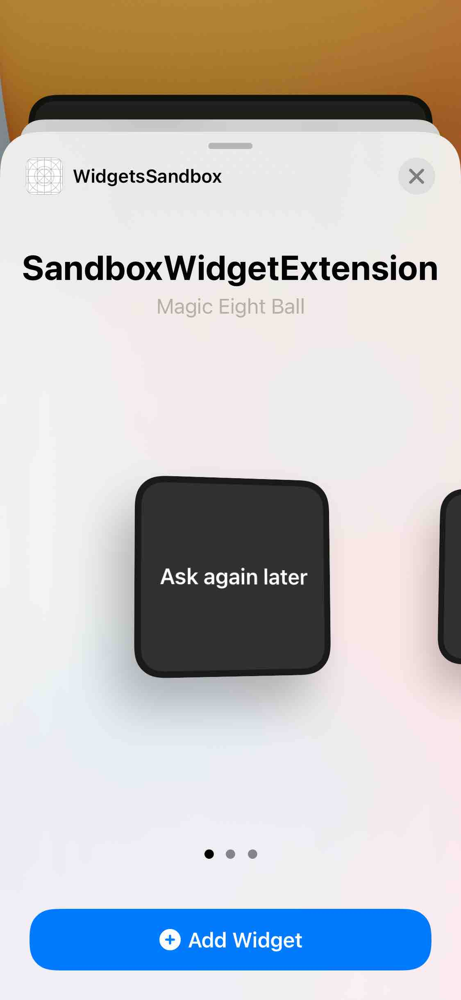
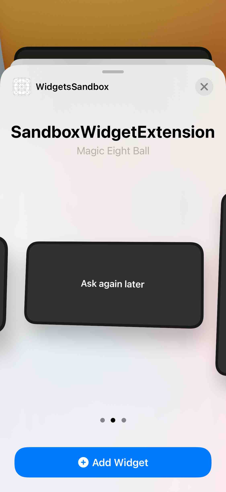
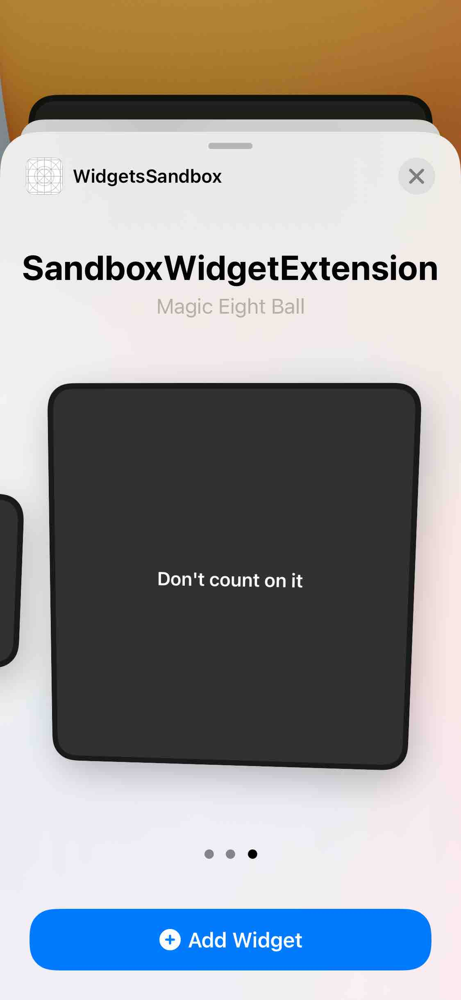

# Widget Sandbox

iOS app whose only purpose is to handle a funny iOS widget to play Magic Eight Ball game 🎱.

## Important concepts

The most basic concepts in widget's development are `TimelineEntry` and `TimelineProvider`.

### TimelineEntry

The widget needs a `Timeline`, a sequence of data that will determine its status as time goes by. Each piece of data is a `TimelineEntry` and the widget uses the information of each entry to configure its appearance and behaviour at a point.
```swift
struct Entry: TimelineEntry {
    let date: Date
    let text: String
}
```

### TimelineProvider

This is a protocol that must be implemented in order to create our own `TimelineProvider`.

#### Snapshot & placeholder

Provides default entry to show widget in the widget's menu.

  

```swift
func placeholder(in context: Context) -> Entry {
    let date = Date()
    return Entry(date: date, text: makePrediction(for: date))
}

func getSnapshot(in context: Context, completion: @escaping (Entry) -> Void) {
    let date = Date()
    let model = Entry(date: date, text: makePrediction(for: date))
    completion(model)
}
```

#### Timeline

The protocol has a method (that must be implemented) that creates the `Timeline<Entry>` that will define the status of the widget as time goes by.
```swift
func getTimeline(in context: Context, completion: @escaping (Timeline<Entry>) -> Void) {
    var entries = [Entry]()
    var components = Calendar.current.dateComponents(
        [.era, .year, .month, .day, .hour, .minute, .second],
        from: Date()
    )
    components.second = 0
    let roundedDate = Calendar.current.date(from: components)!
    for second in 0..<60 {
        let entryDate = Calendar.current.date(byAdding: .second, value: second, to: roundedDate)!
        let model = Entry(date: entryDate, text: makePrediction(for: entryDate))
        entries.append(model)
    }
    let timeline = Timeline(entries: entries, policy: .atEnd)
    completion(timeline)
}
```
In the previous function, an entry is created for each second during a one-minute interval. Specifying `.atEnd` policy, the timeline starts again as soon as it is finished.

### Widget

And last but not least, the heart of the widget. It must be marked as `@main` and in its body property we must return a `WidgetConfiguration` including our custom `TimelineProvider`, a view that represents the widget, the supported families (the widget's sizes that will be supported) and a description to show in the widget's menu.
```swift
@main
struct Config: Widget {
    var body: some WidgetConfiguration {
        StaticConfiguration(kind: "com.serg-ios.WidgetsSandbox", provider: TimeProvider()) { data in
            WidgetView(data: data)
        }
        .supportedFamilies([.systemSmall, .systemMedium, .systemLarge])
        .description(Text("Magic Eight Ball"))
    }
}
```

## Bibliography

https://www.hackingwithswift.com/plus/hacking-with-swift-live-2020/last-but-not-least-widgets

